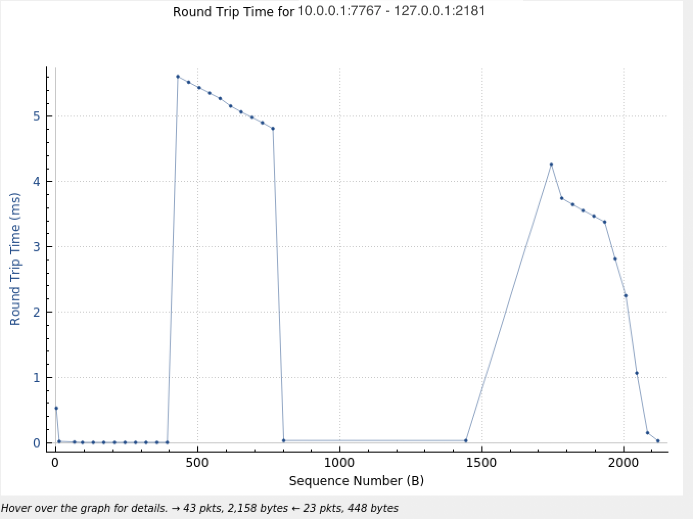

# Assignment 3
Developed by: Rick Tesmond and Jordan Smith

## Overview
Building on Assignment 2, Assignment 3 not includes ownership strength on topic publishing, load balancing of Broker nodes, and a maintained history of topics.

To satisfy the requirements of this assignment:
* Utilized Zookeeper for load balancing and strength tracking, and ZMQ for history negotiation
* Load Balancing nodes based on Topic type (publisher type 1 or type 2), with each broker node providing redundency for both types.
  * Replica nodes are created and elected to lead node in-case of singular node failure
    
* Ownership Strength is tracked using the 1-based highest power, where publishers who do not have ownership are suspended until they can become the owner.
* History QoS is compliant with the assignment requirements and can provide access to historic samples of a given topic.

## Running the Program
System requirements: Ubuntu 20.04, ZMQ, Python3, Mininet, Xterm, Zookeeper, Wireshark \
Git clone URL: https://github.com/Tesmond-Smith-CS6831/Assignment3.git

**Ensure your mininet infrastructure and Zookeeper server can speak with each other**

1. In your Ubuntu environment, clone our repo and cd into the root of our repo.

2. Open a terminal session, and enter (without the quotes) "sudo mn -x --topo=tree,fanout=3,depth=2".
   * If everything is installed properly, you should see 9 hosts spin up, and an Xterm window open for each host.
    * If this did not occur, make sure you have mininet and xterm installed.
    
3. Spin up the middleware file on any of the host terminals by utilize the command line input: python3 middleware.py'
    * Zookeeper handles all leadership elections in which the middleware broker objects, have their own unique access ports
    * Middleware also handles leader replication and load balanced fault tolerance.
    
4. Spin up the Publishers on other hosts using 'python3 publisher.py ip-of-broker history-to-keep'
   * Example: 'python3 publisher.py 10.0.0.5 1/2 ZipCode(e.g. 23666)'
   * The publisher script can take three commandline arguments: 
      * ip-of-broker: IP address of the broker. Defaults to 'localhost'
      * publisher-flag: This input allows either input 1 - allows publishing of any topic vs. input 2 - publishing of singular topic. Defaults to 1
      * topic-to-publish: if input 2 is chosen, input for the specific topic to publish on. Defaults to 10001
          * Example: "python3 publisher.py localhost 2 45208"
      * history-to-keep: integer value of history samples to keep. Defaults to 10.
    
5. Spin up the Subscriber on other hosts using 'python3 subscriber.py ip-of-broker topic-zip'
   * Example: 'python3 subscriber.py 10.0.0.5 53715 10' 
   * Subscriber script takes three command line args:
     * broker-ip: IP address of middleware broker. 'localhost' if running locally. Default: localhost
     * topic-zip: zipcode you are interested in receiving weather info from. Default: '10001'
     * number of times to listen for a specefic topic. Default: 10
    
**Ensure you execute Middleware first! Publisher and Subscriber order does not matter following middleware execution!**
    
As soon as the system is set up, you should begin to see Subscribers receiving information for their subscriber topics!
 * As a note, depending on the toggle switch used in the publisher, the time to receive information to the subscriber may vary

## Testing
### Unittesting
In order for the unit tests to run properly, ensure your dev environment has the dependencies necessary but running 'pip install -r requirements.txt'. This will load your environment with the necessary libraries.
Once this step is complete, simply run "python3 test.py".

Note the majority of these tests are connectivity tests; please follow the instructions above to fully test out our code/process!

### Simulations and Graph Output
Tested using Mininet and Wireshark.

To ensure our code matched the necessary use cases (approach #1 and approach #2), we ran simulations of the expected I/O rates and roundtrip packet times for our cases. These were captured by running wireshark in tandem with mininet to monitor all traffic and acknowledgements through our middleware.

Similar to what we witnessed in Assignment #1 and #2, we saw the expected performance boost from approach #1 where publishers disseminated topic information without dedication to a specific topic resulted in correct data responses from one host to another in a matter of seconds, while with approach #2, where publishers disseminated dedication topic information, successful delivery of the topic data to interested subscribers was almost instantaneous.

From our graphs, I did not notice any notable performance changes from the addition of Topic Ownership nor History when it came to I/O flow and Roundtrip Times. This is not too surprising because any noticeable changes wouldn't appear in RTT nor IO data; however, if we were monitoring Topic I/O, we would likely see a lower flow because Ownership would ensure one topic publisher would publish data at a time.

Regarding the new fault-tolerant broker setup with loadbalanced Broker nodes, functionality is successfully maintained even in the instance of nodes being killed off, and we can see the load being distributed across nodes. Since we chose to load balance across publisher types, we see the clear divide of traffic in our I/O and RTT graphs below:

During the run, I alternated adding in Broker nodes, publishes, and subscribers. As the graph above shows, there was no interruption in traffic when Broker nodes entered and left our system. 

As for the load balancing, the RTT graph below shows the traffic over a port used only for Type 2 publishers:

Despite the pub/sub flow constantly sending/recieving data; this broker node is only active when handling request/responses for nodes sending type 2 data. This shows that the load is distributed between nodes, because we are not seeing any type 1 data flowing through this node.